# Website
对于JSP网站的再一次升级，基于VUE+elementui进行前端页面设计，用户体验和交互更好

## 网页功能演示

## 5.1登录模块

当用户和管理员想要访问网站或者使用网站里一些受限功能的时候，首先需要登录自己的账号，在如图5.1所示的登录页面中输入用户或者管理员的用户名和密码，系统将验证用户或者管理员输入的用户名和登录密码与系统数据库中存储的信息是否一致。如果输入账号错误，则会提示“用户名不存在”，如图5.2所示，如果输入的密码错误，则会提示“密码错误”，如图5.3所示。

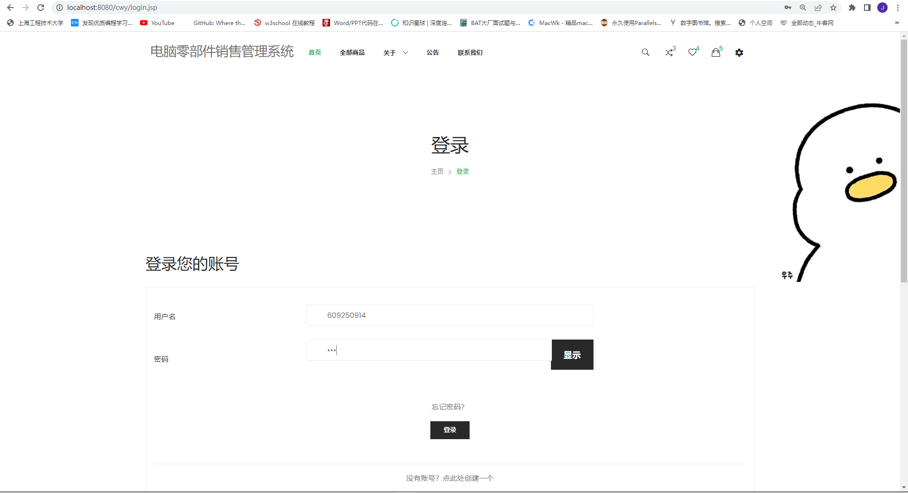

图5.1 用户/管理员登录界面

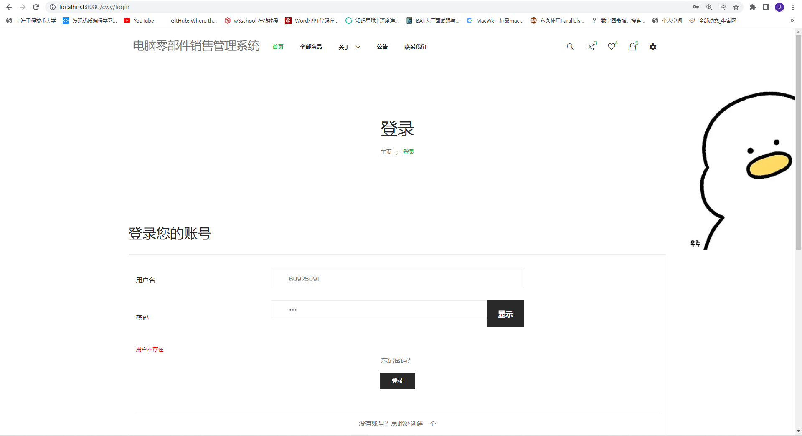

图5.2 用户名输入错误

图5.3 密码输入错误

 

如图5.4所示，如果输入账号和密码正确，则会跳转到首页，如图5.5所示，向下滚动页面能够看到企业特色的商品，如图5.6所示，点击右上角齿轮状按钮，能够看到当前登录账号的昵称。

图5.4 登陆成功界面

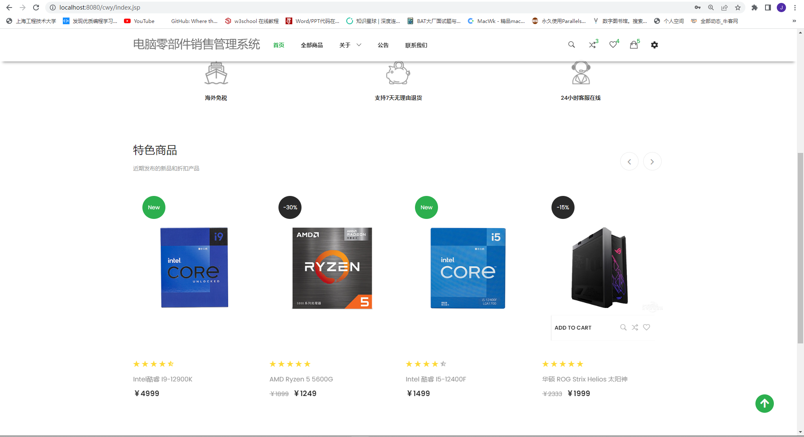

​                         图5.5 特色商品

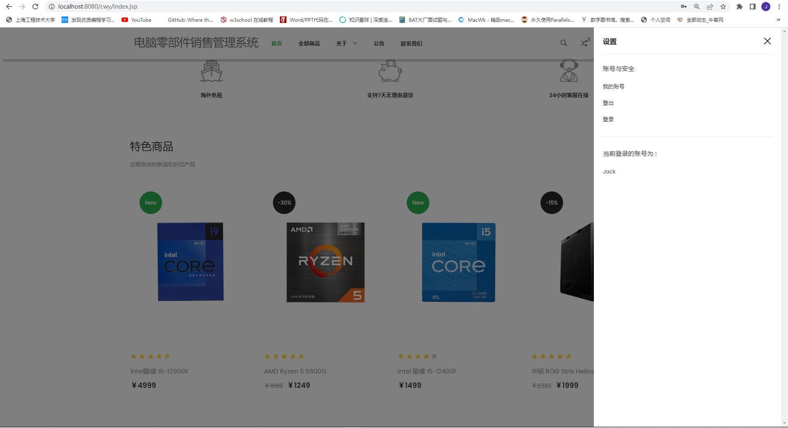

​                   图5.6 侧边栏显示当前登录账号及账号管理功能

如图5.7所示，如果是管理员则会跳转至的管理员用户管理页面。 

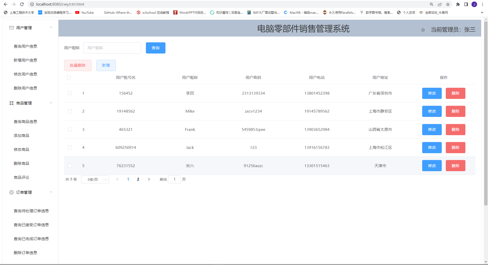

图5.7 管理员用户管理界面

## 5.2 注册模块

如果用户没有账号密码，必须先进行注册，点击图5.1的“没有账号，点击此处创建一个”，出现如图5.8所示的注册页面，注册页面要求输入用户名、昵称、密码 、电话、地址，所有的输入框都含有属于自己的检验规则且不能为空，只有按照正确的格式进行输入才能够成功注册。例如用户名没有输入，则会提示“用户名不能为空”，如图5.9所示。

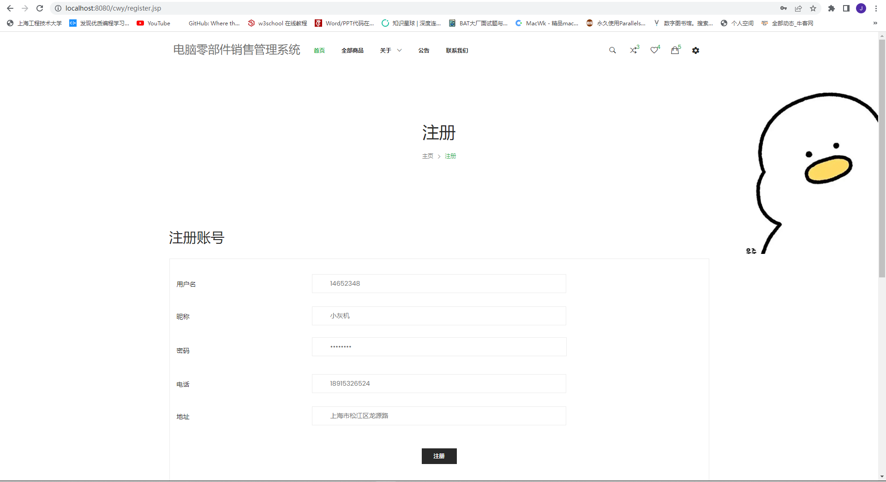

图5.8用户注册界面

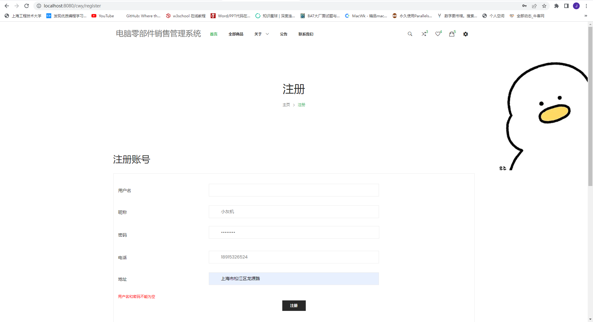

​              图5.9 用户名为空的错误提示

  如图5.10所示，用户注册成功则会显示注册成功并跳转到登录界面。

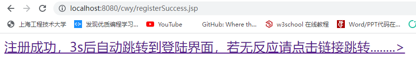

​                             图5.10 用户注册成功

## 5.3 购物车模块

​    用户在浏览商品时如果碰到感兴趣的商品，可以将商品暂存在购物车中，方便后续查看。

  如图5.11所示，用户登录跳转到首页后，在特色商品浏览一块将光标移动到感兴趣的商品，浮现小窗口显示加入购物车的字样，点击加入购物车即可将商品加入购物车。

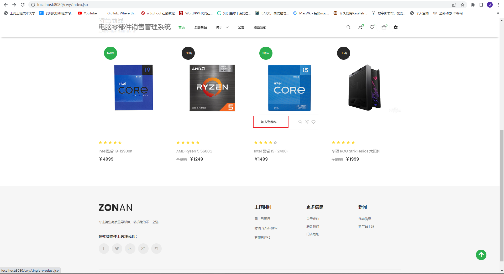

​                         图5.11 加入购物车功能实现

​    如图5.12所示，点击红框所示购物袋小图标即可打开购物车侧边栏，能够看到图5.11点击添加的商品已经成功加入购物车。

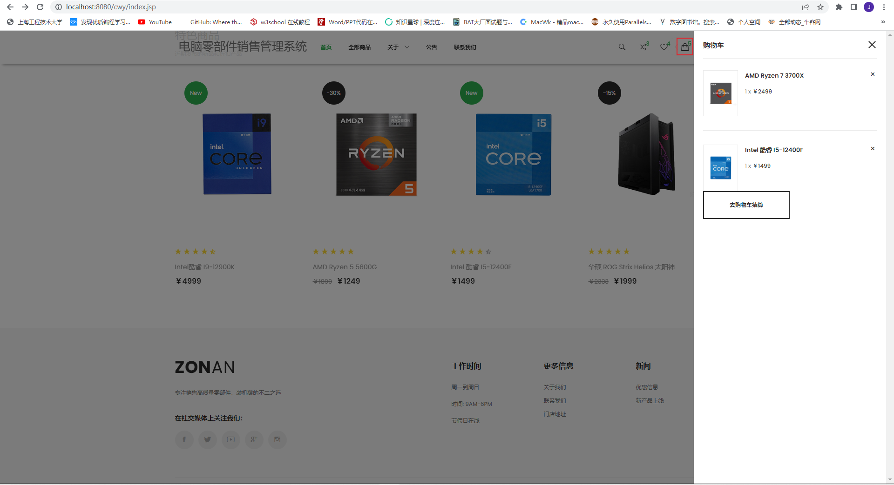

​                         图5.12 打开购物车侧边栏查看当前购物车内商品

​    如图5.13所示，点击图5.12上去购物车结算跳转到购物车主界面，如图5.14所示上下滚动鼠标可以看到当前购物车内所有的商品。

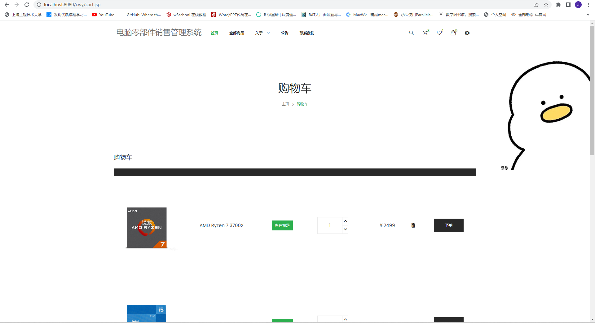

​                         图5.13 购物车主界面

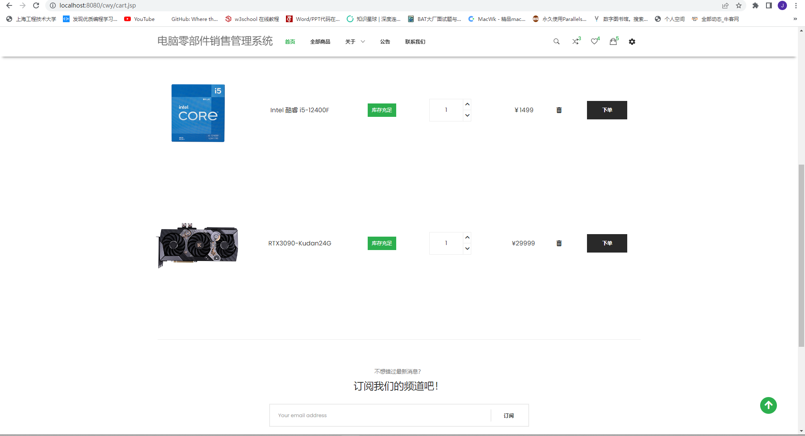

​                         图5.14 滚动鼠标查看购物车界面所有商品

​    如图5.15所示，单击下单按钮即可对商品进行下单，若用户尚未登录账号，则会显示您还没有登录，请登陆后再下单并跳转到登录界面。

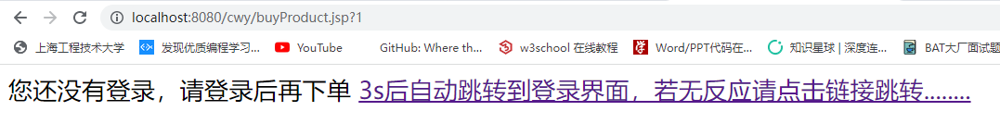

​                         图5.15 下单失败

​    如图5.16所示，若用户已经登录账号单击下单，则会显示下单成功并显示购买数量，并等待页面自动跳转回全部商品页面。

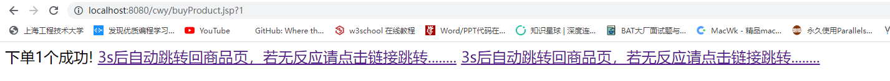

​                         图5.16 下单成功

## 5.4 用户信息修改模块

​    用户登录注册过后，可以修改个人账号密码来保证个人信息安全，如果收货地址发生改变也可进行修改，同时可以查看个人订单信息。

​    如图5.17所示，将光标移至顶部菜单栏“关于”二字，单击红框区域所示账号与安全进入如图5.18所示的账号与安全的主界面。

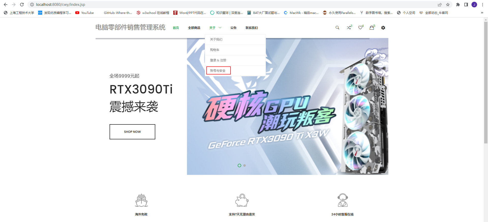

​                             图5.17 选择账号与安全

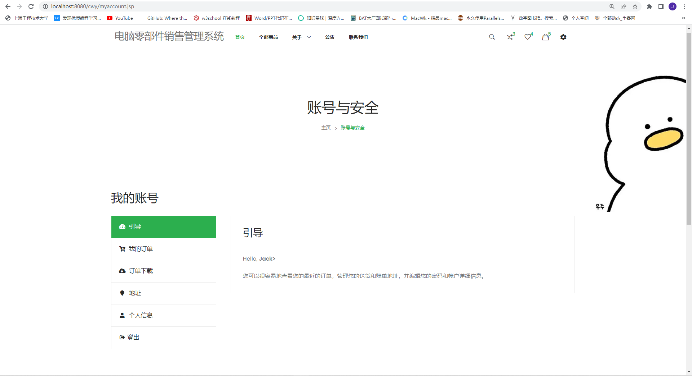

​                            图5.18 账号与安全主界面

​    如图5.19所示，点击侧边栏我的订单，能够查看已经购买的订单详情，查看订单目前的状态和订单的总金额。

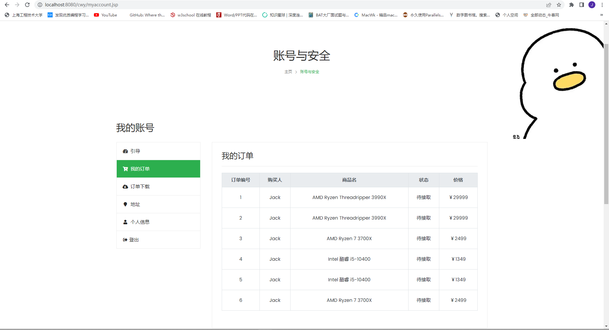

​                            图5.19 我的订单界面

​    如图5.20所示，点击侧边栏地址选项，能够查看到当前用户的收货地址，可在输入框中进行修改并点击修改地址进行提交修改。

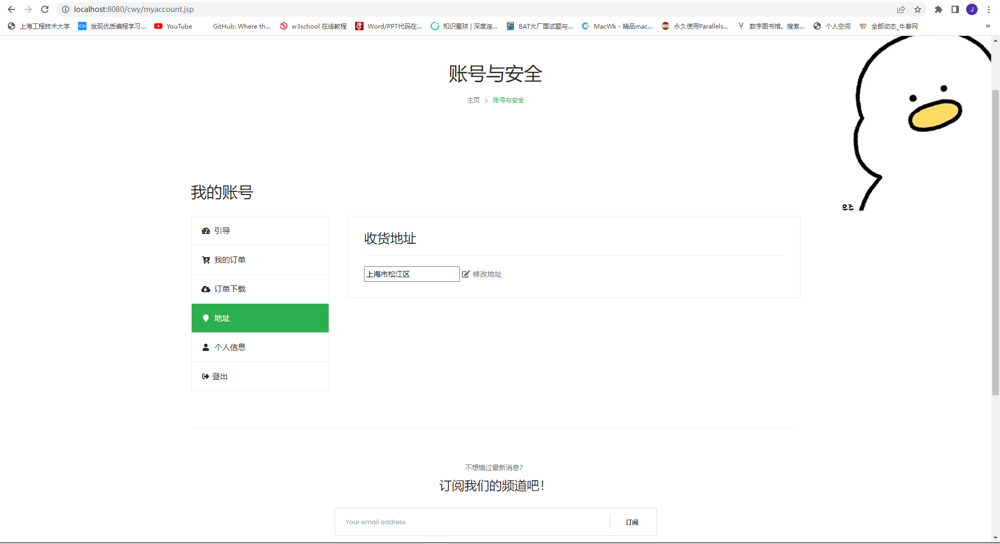

​                            图5.20 地址界面

​    如图5.21所示，点击侧边栏个人信息按钮来到个人信息界面，个人信息界面将显示当前登录的账号名，并且账号名不允许更改，用户能够对用户的昵称和密码进行修改并且单击保存更改进行提交修改。

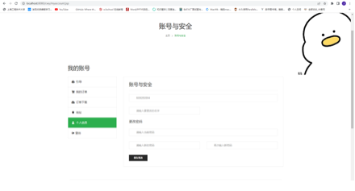

​                            图5.21 个人信息界面

  如图5.22所示，点击侧边栏登出功能系统将退出当前用户账号并返回首页，图5.23所示设置侧边栏显示当前账户为null即退出登录成功。

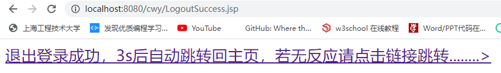

​                            图5.22 退出登录

​                            图5.23 登录账号为null

## 5.5 用户公告查询模块

​    用户公告查询用于给用户提供企业最新的信息，发布优惠活动以及新产品上架的通知。

  如图5.24所示点击顶部菜单栏红框选中的公告字样，可进入如图5.25所示公告主界面。

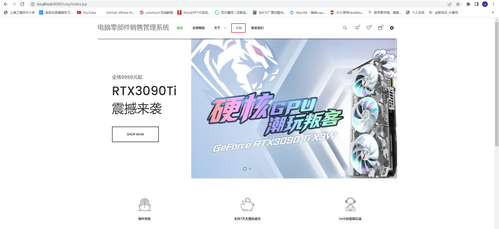                         图5.24 进入公告主界面

​    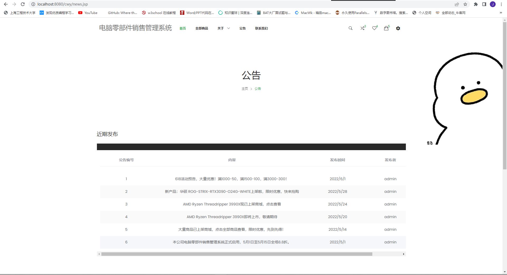

​                            图5.25 公告主界面

## 5.6 订单提交模块

​    如图5.26所示点击红框中的全部商品字样或shop now字样可进入如图5.27所示的全部商品的主界面，如图5.28所示向下滚动页面可查看各种商品。

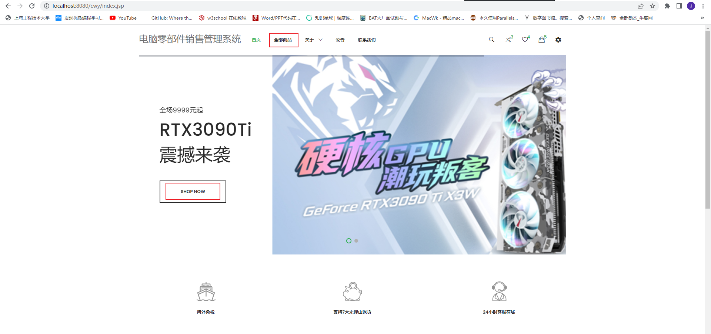

​                         图5.26 进入全部商品界面

​                         图5.27 全部商品主界面

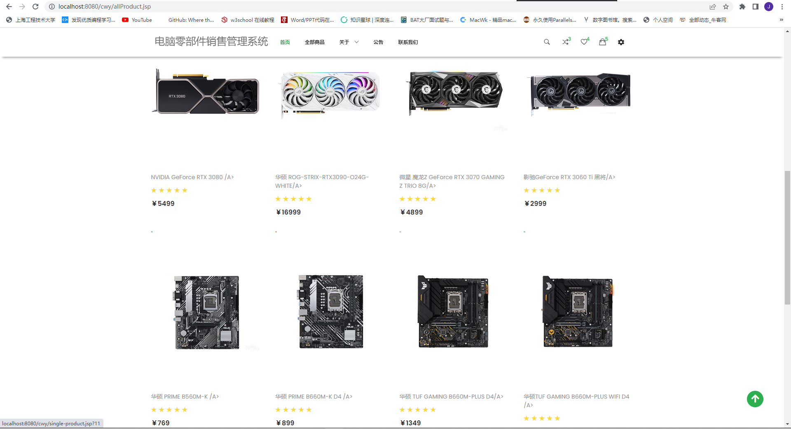

​                         图5.28 向下滚动查看全部商品

​    如图5.29所示，用户可通过选择类别进行商品种类筛选，如图5.30所示为选中分类后商品的筛选结果。

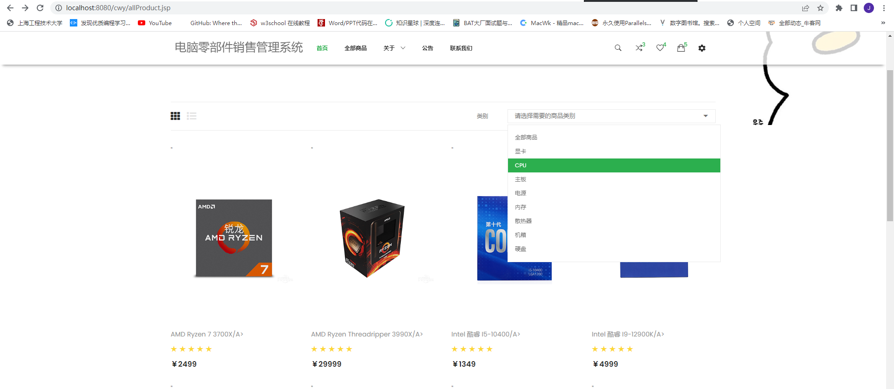

​                            图5.29 选择商品类别

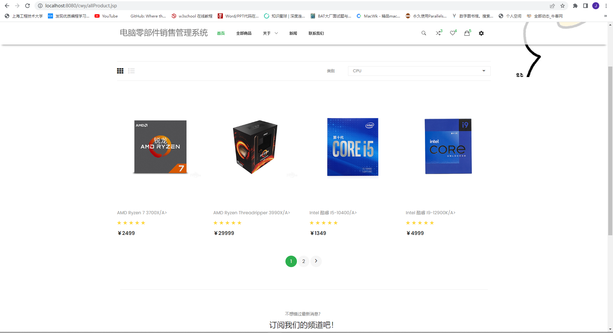

​                            图5.30 筛选后的结果

​    如图5.31所示，单击任意商品，进入商品的详情页面。如图5.32所示，向下滚动页面可查看商品的详细介绍，图5.33商品的细节和图5.34商品评论。

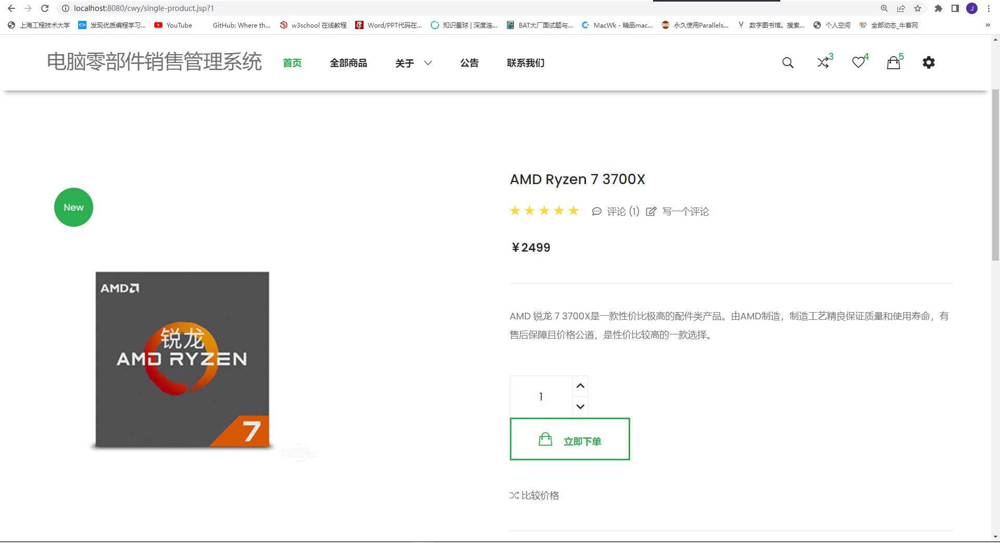

​                             图5.31 商品详情页面

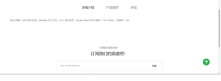

​                            图5.32 商品详细介绍

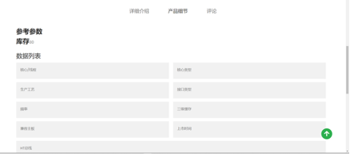

​                            图5.33 商品细节

​                            图5.34 商品评价

​    如图5.35所示，如果用户尚未登录就下单，则会显示您还没有登录，请登录后再下单，并跳转到登录界面。

​                            图5.35 订单提交失败

​    如图5.36，如果用户登录状态下点击下单，则会显示下单的个数，并自动跳转回全部商品页面。

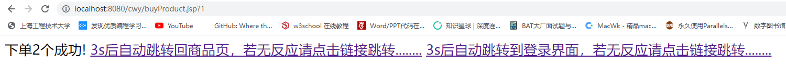

​                            图5.36 订单提交成功

## 5.7 管理员添加用户信息模块

  如图5.37所示，管理员登录跳转到管理员界面，单击红框所示的新增按钮如图5.38所示打开添加用户信息功能。

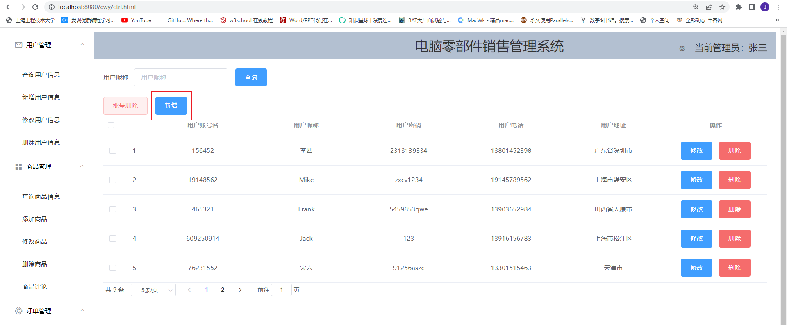

​                            图5.37 管理员添加用户信息

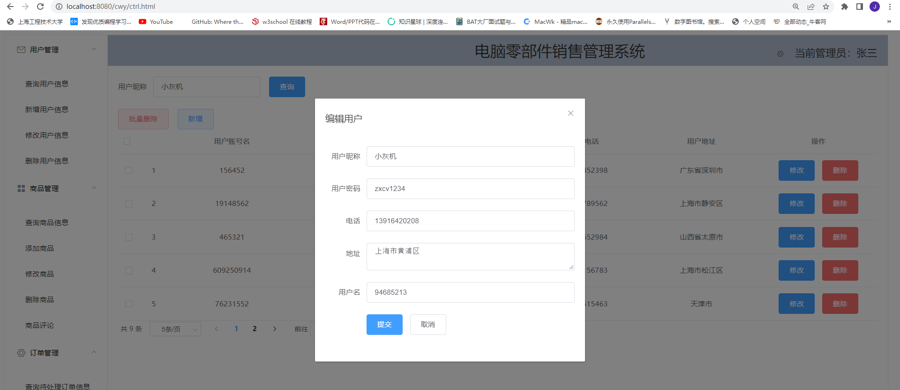

​                            图5.38 添加信息界面

​    如图5.39所示，添加成功则出现弹窗“恭喜你，添加成功”。

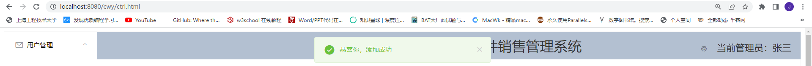

​              图5.39 添加成功

  如图5.40所示，用户信息成功被添加到数据库中，并显示在管理界面。

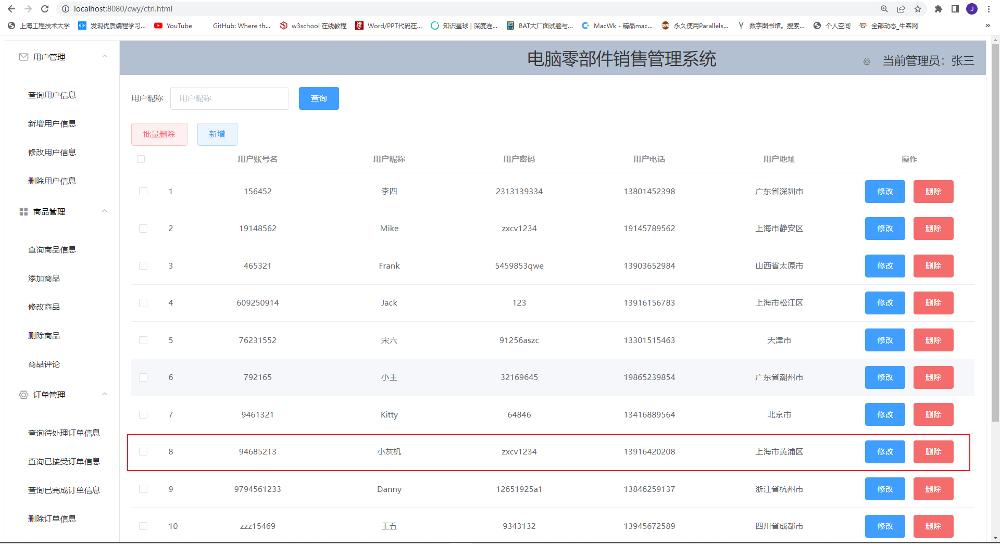

​                            图5.40 用户成功添加

## 5.8 管理员修改用户信息模块

  如图5.41所示，点击红框中的修改按钮进入如图5.42所示的修改用户信息主界面，系统自动选中当前用户信息，管理员可对其进行修改。

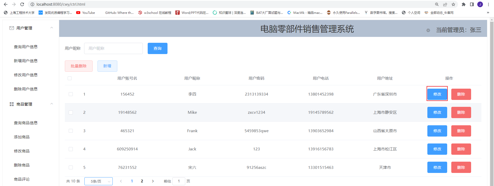

​                            图5.41 管理员修改用户信息

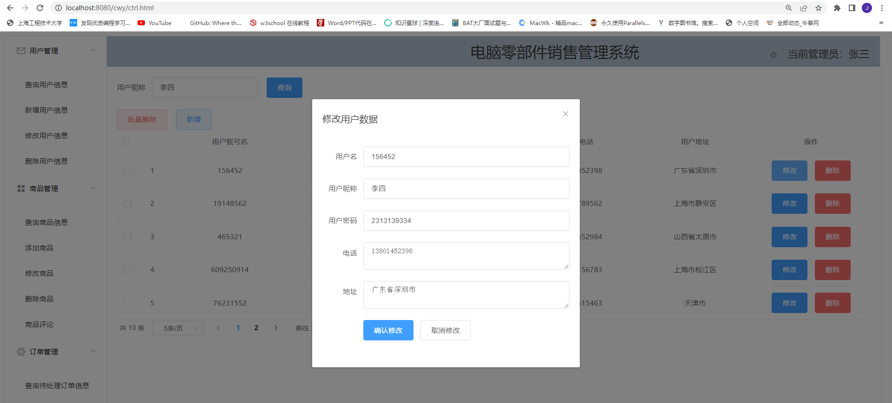

​                             图5.42 管理员修改用户信息界面

​    如图5.43所示，点击确认修改跳出弹窗“恭喜你，修改成功”。若点击取消修改则又回到用户管理界面。

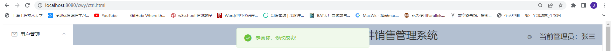

​                            图5.43 修改成功

​    如图5.44所示，李四的账号密码被改为了2313。

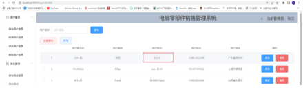

​                            图5.44 用户信息修改回显

## 5.9 管理员删除用户信息模块

​    如图5.45所示单击删除用户信息按钮，即可显示如图5.46所示的删除成功弹窗提醒。并且在用户界面中可以看到编号为1的账号1212已被删除。

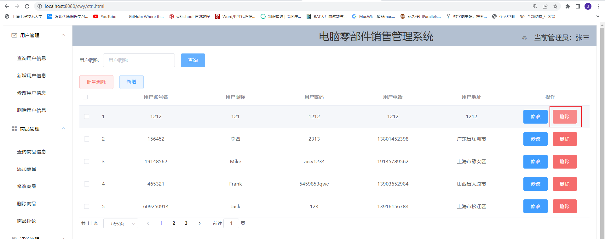

​                            图5.45 删除按钮

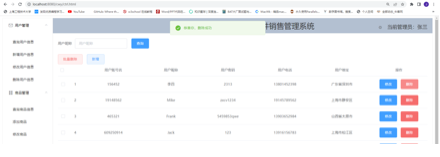

​                             图5.46 删除成功

​    系统同时拥有批量删除的功能，如图5.47所示，通过复选框选中待删除的账号信息，点击批量删除按钮，即可实现批量删除功能。如图5.48所示编号为1，2的用户信息已消失。

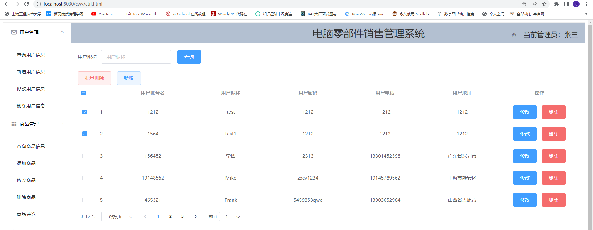

​                            图5.47 复选框选中待删除信息

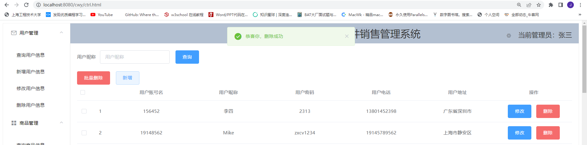

​                            图5.48 批量删除成功

## 5.10 管理员查询用户信息模块

  如图5.49所示，在搜索框中输入用户昵称k，搜索框具有模糊查找的功能，单击查询按钮，得到查询结果如图5.50所示，所有用户昵称带有k字符的账号信息均被搜索出来。

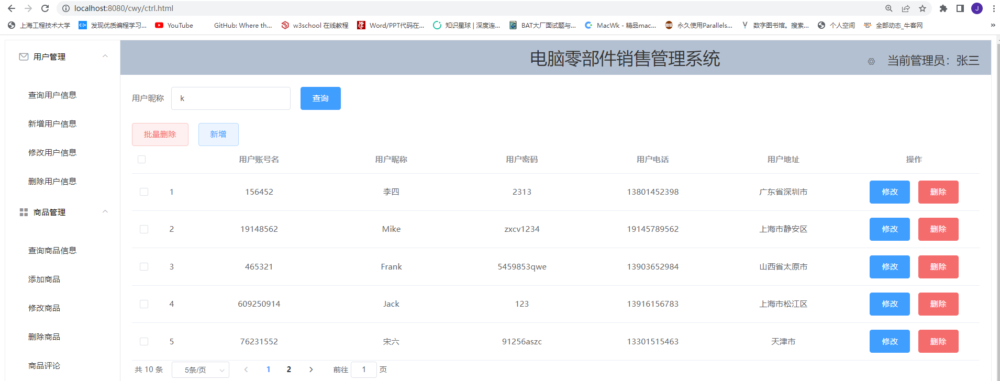

​                         图5.49 搜索框输入

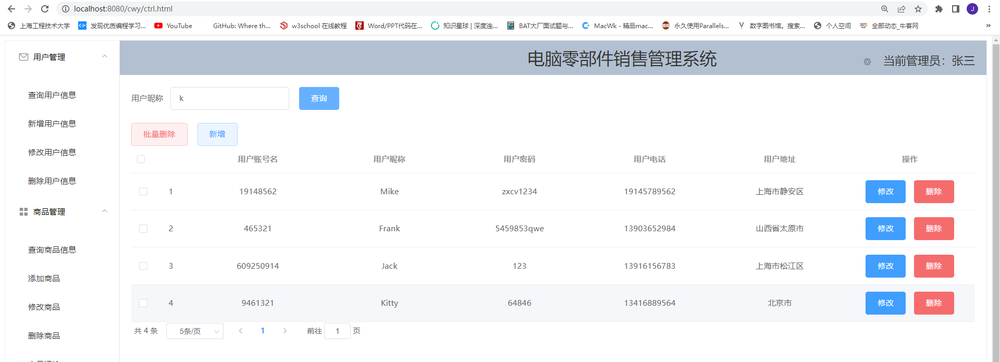

​                         图5.50 模糊查询结果回显

​    如图5.51所示可在下方单击显示条数来进行分页查询，如图5.52所示，点击10条/页即可将10条数据显示在管理界面上。

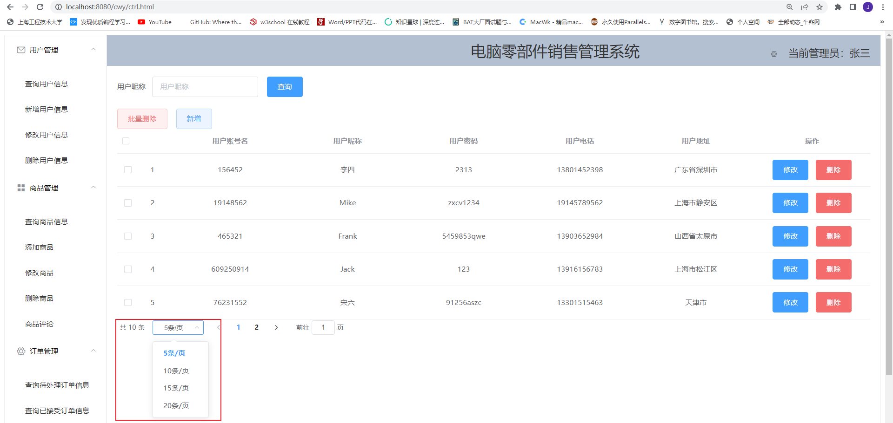

​                         图5.51 分页查询选择

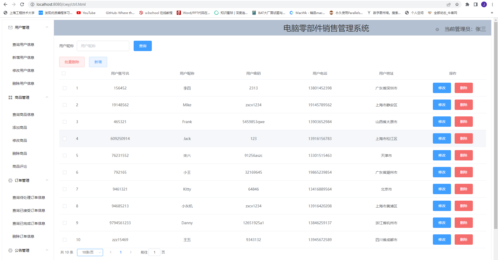

​                         图5.52 分页查询结果显示

## 5.11 新增商品信息模块

如图5.53所示，点击新增按钮进入图5.54所示新增商品信息界面

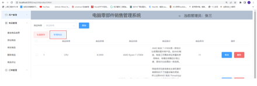

​                      图5.53 进入新增商品页面

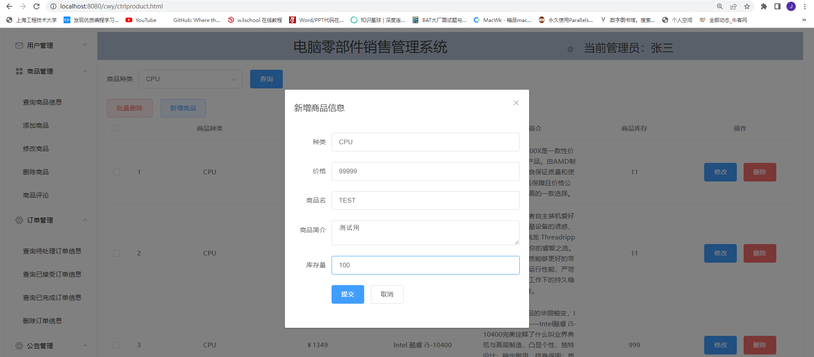

​                         图5.54 新增商品页面

​    如图5.55所示，点击提交，显示恭喜你，添加成功

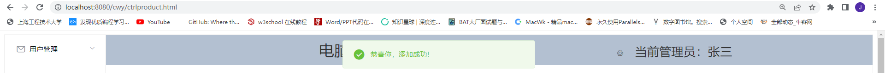

​                         图5.55 添加成功弹窗

## 5.12 修改商品信息模块

如图5.56所示，点击修改按钮进入图5.57所示修改商品信息界面

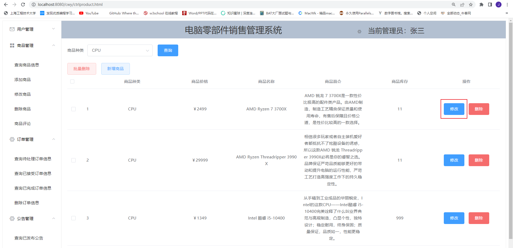

​                        图5.56 进入修改商品界面


​                            图5.57 修改商品信息

  如图5.58所示，点击提交，显示恭喜你，修改成功


​                            图5.58 修改成功提醒

  如图5.59所示，商品库存被修改为1100于界面中回显


​                            图5.59 商品信息修改回显

## 5.13 删除商品信息模块

如图5.60所示单击删除商品信息按钮，即可显示如图5.61所示的删除成功弹窗提醒。并且在商品管理中可以看到编号为3的test商品已被删除。


​                            图5.60 删除按钮

                         图5.61 删除成功弹窗提示

系统同时拥有批量删除的功能，如图5.62所示，通过复选框选中待删除的商品信息，点击批量删除按钮，如图5.63所示即可实现批量删除功能。如图5.64所示商品信息已消失。


​                         图5.62 批量删除选中


​                         图5.63 批量删除成功


​                          图 5.64 删除的商品信息消失

## 5.14 查询商品信息模块

如图5.65所示，在搜索框中选择需要查询的商品种类，单击查询按钮，得到查询结果如图5.66所示，所有CPU类型的商品均被搜索出来。


​                            图5.65 选择商品类别查询


​                            图5.66 商品查询结果

  如图5.67所示可在下方单击显示条数来进行分页查询，如图5.68所示，点击10条/页即可将10条数据显示在商品管理界面上。


​                         图5.67 分页查询


​                         图5.68 分页查询结果返回

## 5.15 查询订单信息模块

  如图5.69所示，选择订单的状态进行查询，如图5.70所示为查询订单状态为“未接取”的所有订单信息。


​                         图5.69 通过订单状态查询订单


​                         图5.70 查询结果返回

## 5.16 修改订单状态模块

如图5.71所示，点击更新按钮进入图5.72所示更新订单信息界面


​                             图5.71 进入更改订单信息界面


​            图5.72 更新订单状态信息界面

  如图5.73所示，点击更新显示“恭喜你，修改成功”，此时发现订单1订单状态从待接取变为已接受。


​                            图5.73 订单信息更新成功

## 5.17 删除订单信息模块

如图5.74所示单击删除商品信息按钮，即可显示如图5.75所示的删除成功弹窗提醒。并且在商品管理中可以看到编号为3的test商品已被删除。


​                            5.74 删除按钮


​                            5.75 删除成功弹窗提醒

  系统同时拥有批量删除的功能，如图5.76所示，通过复选框选中待删除的商品信息，点击批量删除按钮，实现批量删除功能。如图5.77所示商品信息已删除。


​                            图5.76 复选框选中


​                            图5.77 批量删除成功

## 5.18 新增公告信息模块

如图5.78所示，点击新增按钮进入图79所示新增商品信息界面


​                             图5.78 进入新增公告页面


​                           图5.79 新增公告页面

​    如图5.80所示，点击提交，显示恭喜你，添加成功


​                         图5.80 添加成功

   如图5.81所示，公告信息被加入数据库中并在管理系统中显示出来。


​                         图5.81 数据库信息回显

## 5.19 修改公告信息模块

如图5.82所示，点击修改按钮进入图5.83所示修改公告信息界面


​                         图5.82 进入修改公告界面


​                         图5.83 修改公告信息

  如图5.84所示，点击提交，显示恭喜你，修改成功


​                            图5.84 修改成功提醒

​    如图5.85所示，公告发布时间被修改为2022/6/1并于界面中回显


​                         图5.85 公告信息修改回显

 

## 5.20 删除公告信息模块

如图5.86所示单击删除公告信息按钮，即可显示如图5.87所示的删除成功弹窗提醒。并且在公告管理中可以看到编号为7的公告已被删除。


​                     图5.86 删除按钮

                       图5.87 删除成功弹窗提示

系统同时拥有批量删除的功能，如图5.88所示，通过复选框选中待删除的公告信息，点击批量删除按钮，如图5.89所示即可实现批量删除功能，公告信息已被删除。


​                      图5.88 批量删除选中


​                     图5.89 批量删除成功，信息消失

 

## 5.21 查询公告信息模块

如图5.90所示，在搜索框中输入华硕，搜索框具有模糊查找的功能，单击查询按钮，得到查询结果如图5.91所示，所有带有华硕二字的公告信息均搜索出来。


​                         图5.90 搜索框输入


​                         图5.91 模糊查询结果回显

​    如图5.92所示可在下方单击显示条数来进行分页查询，如图5.93所示，点击5条/页即可只将5条数据显示在管理界面上。


​                         图5.92 分页查询选择


​                         图5.93分页查询结果显示
